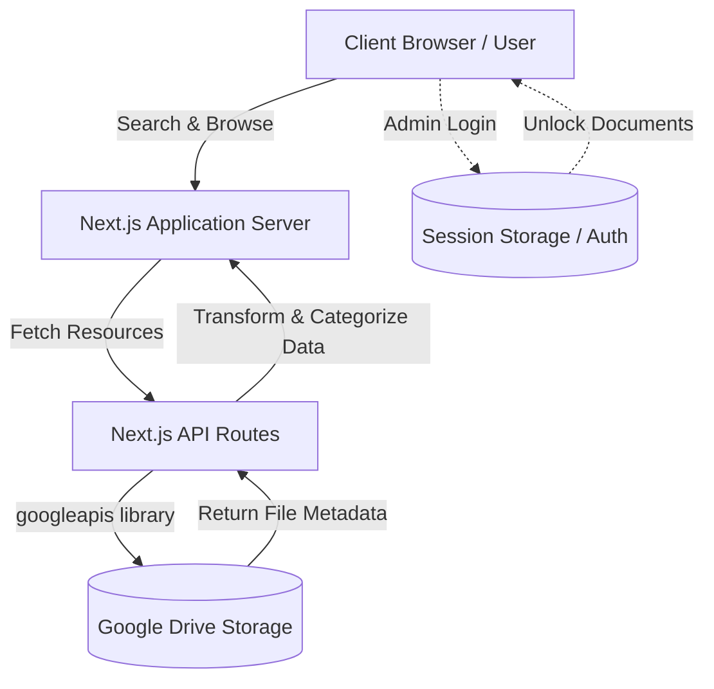

<p align="center">
  <h1 align="center">TanNhaX Tech Resource Center</h1>
</p>

<p align="center">
  A high-performance, modern, and centralized technical resource hub built on top of Next.js and Google Drive API.
</p>

<p align="center">
  <a href="#introduction"><strong>Introduction</strong></a> ·
  <a href="#key-features"><strong>Key Features</strong></a> ·
  <a href="#overall-architecture"><strong>Architecture</strong></a> ·
  <a href="#installation"><strong>Installation</strong></a> ·
  <a href="#roadmap"><strong>Roadmap</strong></a>
</p>

---

## Introduction

Welcome to the **TanNhaX Tech Resource Center** repository. 

Managing technical resources like software, hardware drivers, and internal technical documents can become fragmented and chaotic. TanNhaX Tech Resource Center solves this by acting as a sleek, dynamic front-end wrapper over your Google Drive storage. It automatically categorizes and presents your cloud files in a beautiful, highly searchable, and accessible web interface.

Built with performance and aesthetics in mind, this project adopts modern web standards, leveraging Server-Side Rendering (SSR) and Incremental Static Regeneration (ISR) from Next.js, along with a polished Dark Mode UI.

---

## Key Features

- ⚡ **Real-time Google Drive Sync**: Instantly fetches files from connected Google Drive folders without needing a separate database for file storage.
- 🔍 **Instant Client-Side Search**: Blazing-fast filtering and searching across hundreds of resources by title, description, or category.
- 🛡️ **Category-Level Security**: Built-in authentication prompt for sensitive documents (e.g., internal technical guides) ensuring only authorized admins can download them.
- 🎨 **Premium UI/UX**: Designed with a "Midnight Catalyst" dark theme, glassmorphism effects, and micro-animations to deliver a top-tier user experience.
- 📱 **Fully Responsive**: Seamlessly adapts to any screen size, from large desktop monitors to mobile devices.
- ⚙️ **Admin Configuration Interface**: A dedicated Settings panel protected by session-based authentication to manage system configurations.

---

## Overall Architecture

TanNhaX Tech Resource Center employs a modern decoupled architecture using the **Next.js App Router**. Data is sourced directly from Google Drive, processed by Next.js API Routes, and served to React Client Components.



### Tech Stack
- **Framework:** Next.js 14 (App Router)
- **Language:** TypeScript
- **Styling:** Tailwind CSS & Lucide React Icons
- **Cloud Integration:** Google Drive API v3
- **State Management:** React Hooks (`useState`, `useMemo`) + SessionStorage

---

## Installation

### Prerequisites
- Node.js 18.17.0 or later
- npm or pnpm or yarn
- A Google Cloud Console project with the **Google Drive API** enabled.

### Steps
1. Clone the repository:
   ```bash
   git clone https://github.com/your-username/tannhax-tech-resource-center.git
   cd tannhax-tech-resource-center
   ```

2. Install dependencies:
   ```bash
   npm install
   ```

---

## Env Configuration

You must provide a valid Google Drive API Key to allow the application to read files from your public folders.

1. Create a `.env.local` file in the root directory.
2. Add the following variables:

```env
# Google Cloud API Key with Google Drive API access enabled
GOOGLE_DRIVE_API_KEY=your_api_key_here
```

> [!WARNING]
> Ensure that the Google Drive folders you are targeting are set to **"Anyone with the link can view"**. The API Key alone cannot bypass private folder restrictions.

---

## Running the Project

### Development
To start the local development server:

```bash
npm run dev
```
Open [http://localhost:3000](http://localhost:3000) with your browser to see the result.

### Production Build
To build the application for production:

```bash
npm run build
npm start
```

---

## Folder Structure

The project strictly follows Next.js App Router conventions.

```text
tannhax-tech-resource-center/
├── src/
│   ├── app/                    # Next.js App Router pages and layouts
│   │   ├── api/                # Backend API Routes (Google Drive fetch logic)
│   │   ├── documents/          # Protected documents route
│   │   ├── drivers/            # Filtered drivers route
│   │   ├── settings/           # Admin settings & Auth route
│   │   ├── software/           # Filtered software route
│   │   └── page.tsx            # Main dashboard / Home
│   ├── components/             # Reusable React UI Components
│   │   ├── layout/             # Sidebar, Header, etc.
│   │   ├── resources/          # ResourceCard
│   │   └── ui/                 # Generic UI (Pagination, Loaders)
│   ├── hooks/                  # Custom React Hooks (useDriveResources)
│   └── lib/                    # Core utilities and Google Drive client setup
├── public/                     # Static assets (images, fonts)
├── tailwind.config.ts          # Tailwind CSS configuration
└── next.config.mjs             # Next.js configuration
```

---

## Contribution Guidelines

We welcome contributions! Please follow these steps to contribute:

1. **Fork** the repository on GitHub.
2. **Clone** your fork locally.
3. **Branch out**: Create a new branch for your feature or bugfix (`git checkout -b feature/your-feature-name`).
4. **Commit**: Write clear, concise commit messages.
5. **Push**: Push your branch to your fork (`git push origin feature/your-feature-name`).
6. **Pull Request**: Open a Pull Request against the `main` branch of the original repository.

> [!TIP]
> Before opening a PR, ensure your code passes all linting rules by running `npm run lint`.

---

## License

This project is licensed under the MIT License. See the [LICENSE](LICENSE) file for details.

---

## Roadmap

- [x] Initial Next.js setup with Tailwind CSS
- [x] Integrate Google Drive API for dynamic file fetching
- [x] Implement robust Client-side Search and Pagination
- [x] Add Admin Security Layer (Document Password Protection)
- [x] Dedicated routes for Software, Drivers, Documents, and Settings
- [ ] **Upcoming:** Integrate MongoDB for enhanced metadata storage
- [ ] **Upcoming:** Implement OAuth2.0 / JWT Authentication for full Admin Management
- [ ] **Upcoming:** Add Analytics Dashboard to track resource downloads

---

*Crafted with precision by the TanNhaX Architecture Team.*
