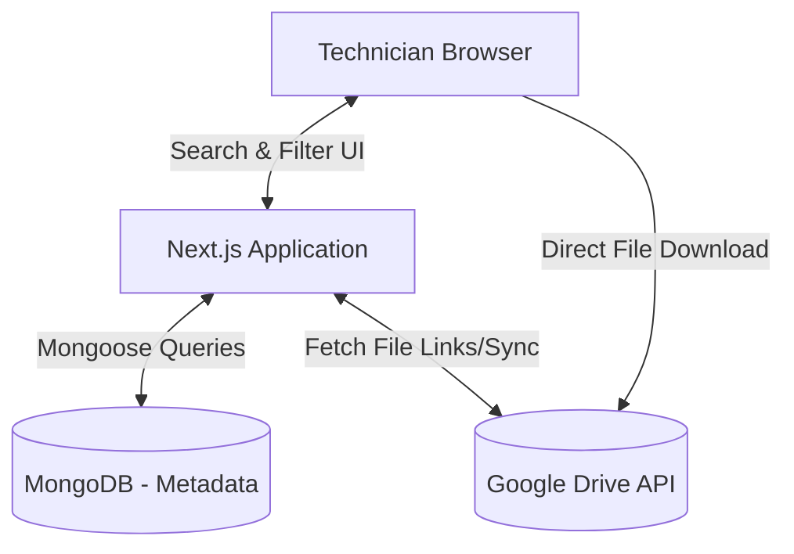

# Architecture Overview

## System Context
TanNhaX operates as a decoupled architecture where metadata is served rapidly via MongoDB, while heavy file payloads are offloaded to Google Drive.

## Design Patterns & Principles
1. **Separation of Concerns:** UI components are strictly separated from data-fetching logic using React Server Components.
2. **Serverless APIs:** Backend functions operate as stateless Vercel Serverless Functions.
3. **Optimistic UI:** Client-side interactions update instantly while syncing with the server in the background (via SWR or React Query).
4. **Adapter Pattern:** Google Drive integration is wrapped in an isolated service class to allow swapping storage providers if necessary in the future.
